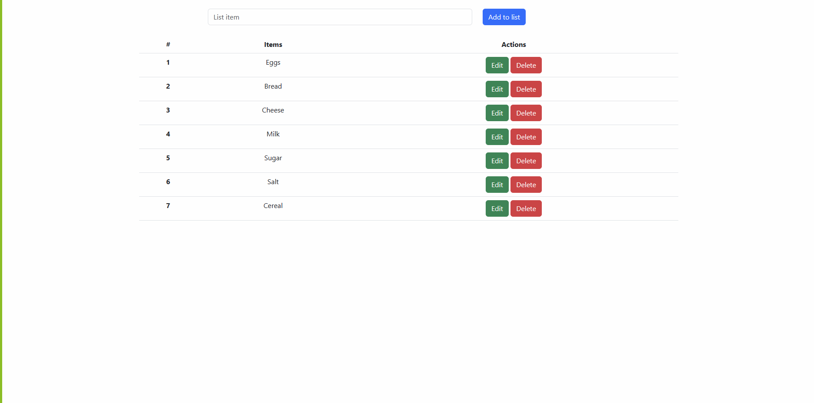

# To Do List Web App 📝

This is a simple web app that lets you create and manage a to do list. You can add, edit, or delete items from your list. The app uses Flask, Bootstrap, HTML, JavaScript, and Python. It also uses a text file to store the data.

# Features 💡

A user-friendly interface with a table and three columns: item, edit, and delete.
A search bar that allows you to type an item or chore and add it to the list by pressing enter or clicking the add button.
An edit button that opens a modal window where you can modify the item name and save the changes.
A delete button that removes the item from the list and the text file.
A text file that stores the data in a comma-separated format.

# Installation 🔧

To run this app, you need to have Python 3 and Flask installed on your system. You can install Flask using pip:

pip install Flask

You also need to download the files from this repository and save them in a folder. The files are:

* app.py: the main Python script that runs the app.
* list.txt: the text file that stores the data.
* templates: a folder that contains the HTML files for the app.
* static: a folder that contains the CSS and JavaScript files for the app.

# Usage 🚀

To start the app, open a terminal window and navigate to the folder where you saved the files. Then, run the following command:

python app.py

This will launch the app on your local server. You can access the app by opening your web browser and typing the following URL:

http://localhost:5000/

You should see the app interface with a table and a search bar. You can start adding items to your list by typing them in the search bar and pressing enter or clicking the add button. You can also edit or delete your existing items by clicking the corresponding buttons.

# License 📄

This project is licensed under the MIT License. See the [LICENSE] file for details.

# Acknowledgments 🙏

The game was created by me, <b>mattrams</b>. I'm new to programming and eager to learn more.

This app was made as a personal project to practice and showcase my skills.